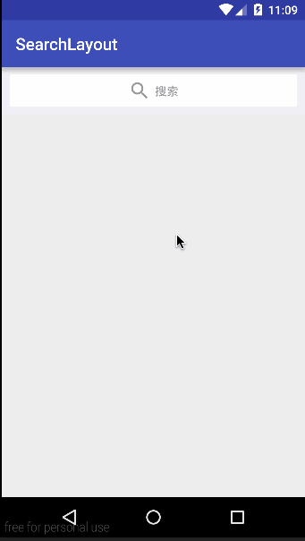

# SearchLayout
  

### 高仿IOS搜索框，支持UI定制，所有属性均有默认值，支持各种按键回调监听，轻量级文件，简单到无法想象！
## gradle:
```groovy
dependencies {
    ...
    compile 'sing.searchlayout:library:1.0.3'
}
```
## Maven:
```xml
<dependency>
　　<groupId>sing.searchlayout</groupId>
　　<artifactId>library</artifactId>
　　<version>1.0.3</version>
　　<type>pom</type>
</dependency>
```  
#### 自定义属性介绍  
属性|介绍  
---|---  
searchTextColor | 搜索框文字的颜色
searchTextSize | 搜索框文字的大小
searchTextColorHint | 搜索框提示文字的颜色
searchButtonColor | 按钮文字的颜色
searchButtonTextSize | 按钮文字的大小
searchBackgroundColor | 最外层父控件的背景颜色
searchTextBackground | 搜索框的背景
searchDrawableLeftIcon | 左边的图标
searchDrawablePadding | 左边的图标的距离
searchHint | 提示文字
searchSingleLine | 搜索框是否单行显示
searchButtonEmptyTxt | 搜索按钮为空字符
searchButtonTxt | 搜索按钮不为空字符
searchPadding | 搜索框距离最外层的距离，若有值，以下4个属性均无效
searchPaddingLeft | 搜索框距离最外层的左边距离
searchPaddingTop | 搜索框距离最外层的上边距离
searchPaddingRight | 搜索框距离最外层的右边距离
searchPaddingBottom | 搜索框距离最外层的下边距离
searchHeight | 搜索框高度（不是整个View的高度）
searchImeOption | 键盘的选项(回车键那里的变化，枚举值)
searchButtonWidth | 按钮宽度

说明：整个view的高度为：searchHeight + searchPaddingTop + searchPaddingBottom
    
#### 监听的回调及部分方法 
```JAVA
searchLayout = (SearchLayout) findViewById(R.id.search_layout);
// 设置右侧按钮的回调，返回当前输入框输入的文字，以及是否为搜索或取消
searchLayout.setOnSearchListener(new SearchLayout.OnSearchListener() {
    @Override
    public void onClick(String str, boolean isSearch) {
        Toast.makeText(MainActivity.this, str + "," + isSearch, Toast.LENGTH_SHORT).show();
    }
});
// 设置回车键按钮的监听，前提是得设置了相关选项
searchLayout.setImeOptions(EditorInfo.IME_ACTION_SEND);
searchLayout.setOnEditorActionListener(new SearchLayout.OnEditorActionListener() {
    @Override
    public boolean onEditorAction(TextView v, int actionId, KeyEvent event) {
        if (actionId == EditorInfo.IME_ACTION_SEND) {
            Toast.makeText(MainActivity.this, "点击了按钮，actionId = " + actionId, Toast.LENGTH_SHORT).show();
        }
        return false;
    }
});
// (满足部分情景) 设置输入框状态，true是输入框移至左侧，自动弹出键盘，否则反之
searchLayout.changeLayout(true);
// 弹出收起键盘，changeLayout()方法中调用了此，方法，特殊情况使用
searchLayout.setSoftInput(true);
```
目前自定义属性都是在xml布局里面设置，后续将增加代码动态设置的方法。  
### 核心代码
#### 输入框的动画
输入框的动画是利用了 ConstraintLayout 的属性通过改变 EditText 的宽度来实现动画的：
```JAVA
TransitionManager.beginDelayedTransition(constraintLayout);
constraintSet.constrainWidth(R.id.et, constraintLayout.getLayoutParams().width);
// constraintSet.constrainWidth(R.id.et, LayoutParams.WRAP_CONTENT);
constraintSet.applyTo(constraintLayout);
```
#### 按钮的动画
按钮的动画效果也是利用系统原生的自带动画属性实现的  
ViewGroup 中有个方法 setLayoutTransition ，当子布局发生变化时会触发默认动画，也可以在布局里面设置（是设置在控件的父布局中）：
```XML
android:animateLayoutChanges="true"
```
```JAVA
parent.setLayoutTransition(new LayoutTransition());
```
如果默认值能满足你的 UI ，那么布局相当的简单，甚至你什么都不用写：
```XML
<sing.widget.SearchLayout
    android:id="@+id/search_layout"
    android:layout_width="match_parent"
    android:layout_height="wrap_content"/>
```
当然，如果你要定制 UI ，这么多属性你可以选择性的定制：
```XML
<sing.widget.SearchLayout
    android:id="@+id/search_layout"
    app:search_text_color="#313131"
    android:layout_width="match_parent"
    android:layout_height="wrap_content"
    app:search_text_size="14sp"
    app:search_button_color="#313131"
    app:search_button_text_size="14sp"
    app:search_background_color="#f0eff5"
    app:search_text_background="@drawable/bg_search"
    app:search_drawable_left_icon="@drawable/ic_search"
    app:search_drawable_padding="5dp"
    app:search_hint="搜索"
    app:search_single_line="true"
    app:search_button_empty_txt="取消"
    app:search_padding="8dp"
    app:search_button_txt="搜索"
    app:search_height="40dp"
    app:search_imeOption="actionSend"
    app:search_button_width="40dp"
    app:search_text_color_hint="#9a9a9c"/>
    <!--app:search_padding_right="8dp"-->
    <!--app:search_padding_top="8dp"-->
    <!--app:search_padding_left="8dp"-->
    <!--app:search_padding_bottom="8dp"-->
```
到这里基本可以满足你的需求，如果有问题可以在 Issues 中留言。
